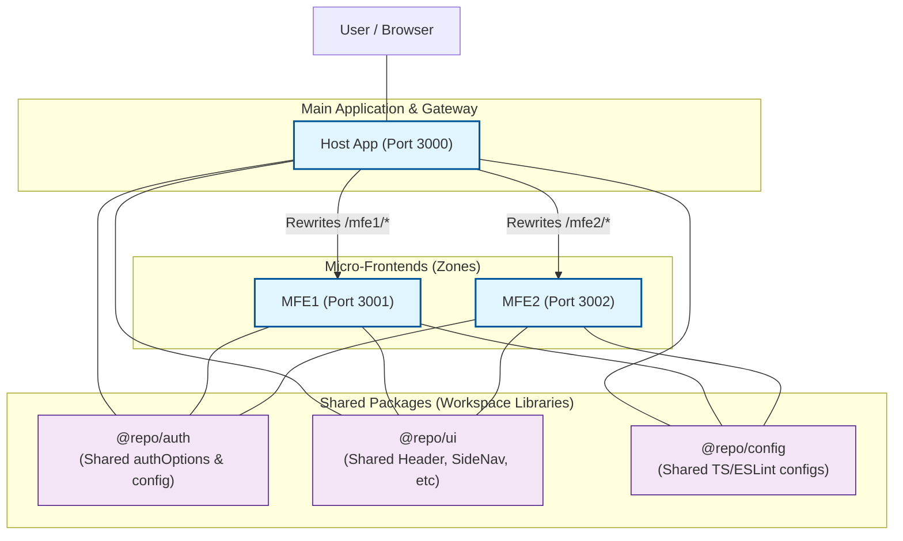

# Architecture Diagram

This diagram visualizes the Multi-Zones architecture of the `practice-mono` workspace.

## Key Architectural Decisions

- **Multi-Zones**: Next.js Multi-Zones allows merging multiple Next.js applications into a single domain. The **Host** app acts as the entry point and routes sub-paths to independent **MFE** apps.
- **Shared Authentication**: All apps utilize the `@repo/auth` package, ensuring consistent session management across the zones. Since they share the same domain (via the Host rewrites), the session cookies are accessible to all zones.
- **Shared UI**: The `@repo/ui` package provides a unified look and feel with shared components like the `Header` and `SideNav`.
- **Workspace Dependencies**: Using pnpm workspaces, internal packages are linked using the `workspace:*` protocol, allowing for seamless local development and shared logic.

## Advantages and Disadvantages

### Advantages
- **Independent Development & Deployment**: Teams can work on and deploy different MFEs independently without affecting the rest of the system.
- **Unified User Experience**: For the user, it feels like a single application under one domain.
- **Shared Resources**: Logic, styling, and authentication are shared across zones using internal packages.
- **Performance**: Improved initial load times as only the code for the active zone is loaded.
- **SEO Friendly**: Server-side rendering is maintained across all zones, ensuring excellent search engine visibility.

### Disadvantages
- **Increased Complexity**: Managing multiple applications and their routing logic (rewrites/asset prefixes) is more complex than a monolith.
- **Operational Overhead**: Requires running and monitoring multiple services simultaneously.
- **Potential Resource Duplication**: Common dependencies might be loaded multiple times if not carefully optimized.
- **Local Dev Resource Intensity**: Running multiple dev servers can be demanding on local development machines.
